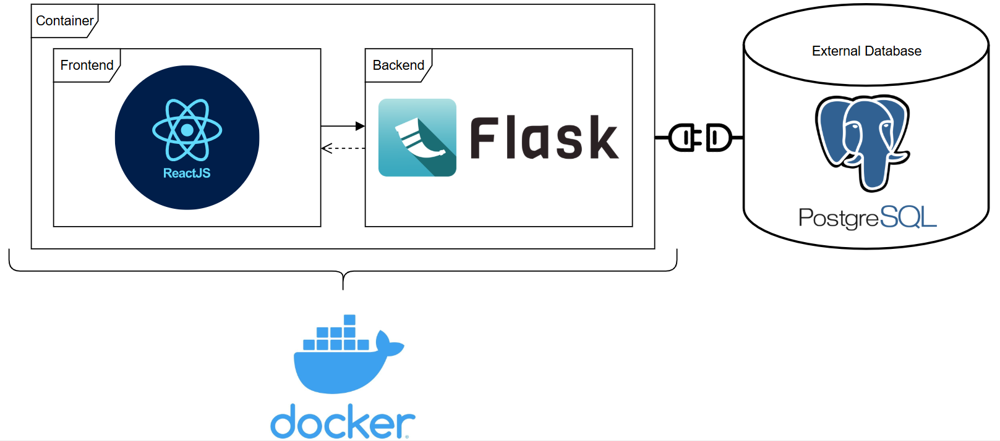

# eCamion-OCPP

## System Model

The current system model consists of 4 components:
- The frontend (client-side), based in ReactJS (Node.js).
- The backend (server-side), based in Flask (Python).
- The application container, powered by Docker. The dashboard application, consisting of the frontend and backend components, resides within and is deployed via Docker.
- The external database, based in PostgreSQL. The external database resides outside the dashboard application, and outside the docker container. The database connection is set through environment variables, explained in further sections.

## Steps to Run/Build 
### Development build
**PREREQUISITES:** You must have the node, python pip, and postgresql (with the necessary database and data prepared, along with the necessary connection details in [/Dashboard/server/db_connection.txt](./Dashboard/server/db_connection.txt)) installed on your machine.
#### Backend
- Navigate to [/Dashboard/server/](./Dashboard/server/).
- Activate the virtual python enironment (**NOTE:** The virtual environment was used for development on a windows machine, the virtual environment may not work as expected on another OS, so you may need to create your own virtual envioronment).
- If required, install the necessary dependencies from the [requirements.txt](./Dashboard/server/requirements.txt) file.
- Run [server.py](./Dashboard/server/server.py). The server will run on port 5000.

#### Frontend
- Navigate to [/Dashboard/client/](./Dashboard/client/).
- If required, install the necessary dependencies using `npm install`.
- Run the frontend using `npm run start`

### Production Build
**PREREQUISITES:** You must have docker installed on the host machine prior to running the following commands, as well as the necessary requiremtns installed on the VM. You must also ensure the necessary enviroment variables are set in a **.env** file in the [/Deployment](./Deployment/) directory. The required environment variables are **DB_HOST** (host address of the database, such as localhost of the docker VM i.e. host.docker.internal), **DB_NAME** (name of the postgresql database), **DB_USER** (postgresql username), **DB_PASS** (postgresql password), and **DB_PORT** (the port on which postgresql is exposed).
- Navigate to the [/Deployment](./Deployment/) directory.
- Run the docker command `docker compose up --build`. This will build and run the containers, of which there are 2. A container for the frontend (Nginx serves the React app running on port 3000, on port 80), and one for the backend (port 5000).
- The dashboard can be accessed by navigating to the frontend on port 3000 of the localhost on the hosting machine.

## Client-side Documentation

### `App.js`

This is the root component of the eCAMION EV Charging Analytics Dashboard React client. It sets up application-wide theming and routing.

#### **Purpose**

Defines the primary structure of the frontend application, establishing routing and theming for the entire interface.

#### **Key Components and Functionality**

- **`ThemeProvider` (from MUI)**  
  Wraps the application in a custom Material UI theme defined in `./styles/Theme.js`, ensuring consistent styling across all components.

- **`BrowserRouter` (aliased as `Router`)**  
  Enables client-side routing using React Router.

- **`Routes` & `Route`**  
  Defines the routing structure. Currently, it includes:
  - `/` → renders the `Home` component from `./pages/Home`

#### **Dependencies**

- `react-router-dom`: Provides routing utilities like `BrowserRouter`, `Routes`, and `Route`.
- `@mui/material/styles`: Used to apply the custom Material UI theme.
- `./pages/Home`: Main landing page component.
- `./styles/Theme`: Defines the custom MUI theme.
- `./App.css`: Global CSS for base styling.

#### **Summary**

This file acts as the root entry point of the application, applying theming and routing. It enables easy scaling by allowing new routes and themes to be added as needed.

---

### `Home.js`

The `Home` component is the main landing page of the eCAMION EV Charging Analytics Dashboard. It acts as the container for the single-page application and renders tabbed views for interacting with the data.

#### **Purpose**

To provide users with a centralized dashboard view that loads and displays data from charging stations, cabinets, modules, etc.

#### **Key Components and Functionality**

- **State Variables**
  - `sites`: Stores all available cabinet/site data fetched from the API.

- **`useEffect()` Hook**
  - On initial render, performs a GET request to `/getstations` using a custom Axios instance.
  - Stores the response in the `sites` state variable.

- **Conditional Rendering**
  - Displays a loading message until `sites` data is available.

- **`BasicTabs` Component**
  - Renders a tabbed interface to display cabinet data.
  - Receives `cabinets={sites}` as props.

#### **Dependencies**

- `React` & Hooks (`useState`, `useEffect`)
- `axios` from `../services/api`: Handles HTTP requests to the backend.
- `BasicTabs` from `../components/TabPanel`: Renders the main data visualization in tabbed format.

#### **Summary**

The `Home.js` component functions as the main entry point for users to view EV charging cabinet analytics. It pulls data on available sites/cabinets, passes this data to a tabbed panel, and contains the entirety of the application.

---

### `TabPanel.js`

This component (`BasicTabs`) renders a tabbed interface for displaying various EV charging cabinet analytics, including health metrics and predictions.

#### **Purpose**

Provides a user-friendly tab-based layout for switching between different analytical views (Cabinet Health, J Health, Module Health, Prediction) related to EV charging cabinets.

#### **Key Components and Functionality**

- **`BasicTabs` (Default Export)**
  - Main component that renders the tab navigation and tab panels.
  - Maintains the active tab index using `useState`.
  - Uses Material UI's `Tabs` and `Tab` components for navigation.
  - Passes the `cabinets` prop to all subcomponents.

- **`CustomTabPanel`**
  - A helper component to conditionally render tab content.
  - Keeps all tab components mounted to retain internal state but only displays the currently selected tab.
  - Accessible with `role="tabpanel"` and proper `aria` attributes.

- **`a11yProps(index)`**
  - Helper function to add accessibility attributes to each tab for screen readers.

#### **Tabs and Content**

1. **Cabinet Health**  
   - Component: `CabinetHealth`  
   - Props: `cabinets`  
   - Purpose: Display metrics and status for entire cabinets.

2. **J Health**  
   - Component: `Jhealth`  
   - Props: `cabinets`  
   - Purpose: Display metrics and status of individual chargers or "J"s.

3. **Module Health**  
   - Component: `ModuleHealth`  
   - Props: `cabinets`  
   - Purpose: Displays analytics related to modules within each cabinet.

4. **Prediction**  
   - Component: `Prediction`  
   - Props: `cabinets`  
   - Purpose: Shows predictive analytics based on historical data and ML models.

#### **Dependencies**

- **Material UI**:
  - `@mui/material/Tabs`, `Tab`, `Box`: Used for UI layout and tab styling.
- **React**
- **PropTypes**: Used to enforce prop types for `CustomTabPanel`.

- **Child Components**:
  - `CabinetHealth`, `Jhealth`, `ModuleHealth`, `Prediction`: Render individual content per tab.

#### **Summary**

The `TabPanel.js` file provides the main tabbed interface for the dashboard, enhancing UX by segmenting analytics into four logical views. It acts as a hub for rendering all key cabinet, charger, and module-related analytics.

---

### `CabinetHealth.js`

The `CabinetHealth` component displays real-time and historical environmental metrics for a selected EV charging cabinet, including temperature, humidity, dew point, and system voltage.

#### **Purpose**

To provide detailed environmental data visualizations for individual cabinets, enabling users to monitor cabinet conditions and track changes over time.

#### **Key Components and Functionality**

- **State Variables**
  - `cabinetTemperature`, `outdoorTemperature`: Latest temperatures inside and outside the cabinet.
  - `cabinetHumidity`, `outdoorHumidity`: Latest humidity levels.
  - `cabinetDewPoint`, `outdoorDewPoint`: Calculated dew points.
  - `selectedCabinet`: Tracks the user-selected cabinet (persisted in cookies).
  - `chartHistory`: Time-series data for temperature, humidity, and dew point.
  - `voltageHistory`: Time-series data for cabinet voltage.
  - `upUntil`: Timestamp of the most recent data point available.
  - `error`, `loading`: Flags for UI state management.

- **`useEffect()` Hook**
  - Listens for `cabinetChange` custom events to sync selected cabinet state across components.
  - Fetches cabinet health and historical data on `selectedCabinet` change.
  - Sets loading and error state as needed.

- **Cabinet Selection**
  - Rendered using `Select` and `MenuItem` components from Material UI.
  - Cabinet selection updates cookie and dispatches a custom `cabinetChange` event for cross-component synchronization.

- **Chart Rendering**
  - Four `HistoryChart` components show trends for:
    - Temperature
    - Humidity
    - Dew Point
    - Voltage

- **SummarySection Components**
  - Three summary cards display current cabinet and outdoor values for:
    - Temperature
    - Humidity
    - Dew Point

#### **Dependencies**

- `React` & Hooks (`useState`, `useEffect`)
- `axios` from `../services/api`: For HTTP data retrieval.
- `js-cookie`: For persisting the selected cabinet.
- `@mui/material`
  - `Select`, `MenuItem`, `InputLabel`, `CircularProgress`: Used for UI elements and feedback.
- **Custom Components**
  - `SummarySection`: Displays quick metrics.
  - `HistoryChart`: Line charts for time-series data.
  - `CustomFormControl`: Styled form control wrapper.

#### **Summary**

`CabinetHealth.js` enables users to view real-time environmental metrics and historical trends for a selected cabinet. It handles cabinet selection, displays summary metrics, and generates multiple line charts to visualize changes in environmental and voltage conditions over time.

---

### `Jhealth.js`

The `Jhealth` component displays health summaries of individual EV charging stations or "J"s over the past 30 days. It dynamically fetches and presents usage data based on the selected cabinet and provides an expandable card interface for reviewing each "J"’s statistics.

#### **Purpose**

To provide a visual and interactive summary of charger-level health metrics such as session count, total session time, and time-series charts for each "J" in a cabinet.

#### **Key Components and Functionality**

- **State Variables**
  - `selectedCabinet`: Tracks the currently selected cabinet ID.
  - `error`: Stores any error encountered during data fetching.
  - `summaryData`: Contains charger summary data including session stats and charts.
  - `upUntil`: Timestamp up to which the data is valid.
  - `loading`: Indicates whether data is being fetched.

- **`useEffect()` for Cabinet Change Events**
  - Subscribes to the global `cabinetChange` event to update `selectedCabinet` across the app.

- **`useEffect()` for Data Fetching**
  - On change to `selectedCabinet`, sends a GET request to `/jsummaries` to fetch J station summary data.
  - Updates summary and timestamp states.

- **Cabinet Selector**
  - Dropdown menu for selecting a cabinet from the provided `cabinets` prop.
  - Saves selection to a cookie and dispatches a custom event to synchronize across components.

- **`ExpandingCard` Component**
  - Renders a card for each J station with:
    - Charger ID
    - Total sessions
    - Total session time
    - Summary chart showing daily session counts

#### **Dependencies**

- `React` & Hooks (`useState`, `useEffect`)
- `axios` from `../services/api`: Handles HTTP requests to fetch charger summary data.
- `js-cookie`: Persists selected cabinet ID across reloads.
- `@mui/material`:
  - `Select`, `MenuItem`, `InputLabel`, `CircularProgress`, `Grid`, `Container`, `Typography`: Used for form controls, layout, and feedback.
- `CustomFormControl`: Wraps form inputs with consistent styling.
- `ExpandingCard`: Custom component for expandable visual summaries.
- `SummarySection` and `HistoryChart`: Present if data needs summarization or visualization (though not directly rendered in this file).

#### **Summary**

The `Jhealth.js` component delivers a cabinet-specific overview of J station activity within a user-friendly card interface. It supports persistent cabinet selection, real-time updates through custom events, and clear presentation of charger usage metrics for analytical insights.

---

### `ModuleHealth.js`

The `ModuleHealth` component presents detailed module-level health data for EV battery strings, including voltage and temperature statistics. It supports dynamic cabinet selection, string toggling, and visual + tabular data rendering.

#### **Purpose**

To visualize and inspect health parameters of modules (grouped by strings) in EV charger cabinets. It supports multiple strings per cabinet and provides clear bar chart and table-based insights.

#### **Main Features**

- **Cabinet Selection**
  - Dropdown for selecting a cabinet (`Select` with MUI).
  - Persisted in a cookie using `js-cookie`.
  - Custom event dispatch (`cabinetChange`) to sync with other components.

- **String Selection**
  - `Tabs` from MUI allow switching between string 1, 2, or 3.
  - Tabs are disabled if corresponding string data is unavailable.

- **Chart Visualization**
  - `SegmentedBarChart` is used to render:
    - Min/Average/Max Cell Voltages
    - Total Voltage
    - Min/Average/Max Temperatures

- **Tabular Data Display**
  - `DataTable` presents a breakdown of module metrics.
  - Supports configurable column order and is ready for future thresholding.

#### **State Variables**

| Variable         | Description                                                                 |
|------------------|-----------------------------------------------------------------------------|
| `selectedCabinet`| Currently selected cabinet ID (stored in cookies)                           |
| `error`          | Tracks data fetching errors                                                 |
| `upUntil`        | Date string indicating the freshness of the data                            |
| `loading`        | Indicates if data is being fetched                                          |
| `moduleData`     | Raw module data for strings 1–3                                             |
| `currString`     | Index of the currently selected string tab (0-based)                        |

#### **Data Processing**

- **`formatDataForTable(moduleData)`**  
  Converts raw object-based readings into row-wise data arrays for charting and table rendering.

- **`tabledata`**  
  Contains an array of arrays. Each index corresponds to a string (e.g., `tabledata[0]` for string1).

- **`headers` and `columnOrder`**  
  Used to control column rendering order in `DataTable`.

#### **Dependencies**

- **React Hooks**: `useState`, `useEffect`
- **Axios**: API calls to `/moduledata`
- **Material UI Components**:
  - Layout: `Box`, `Tabs`, `Tab`
  - Form: `Select`, `MenuItem`, `InputLabel`
  - Feedback: `CircularProgress`
- **Custom Components**:
  - `CustomFormControl`: Styled form wrapper
  - `SegmentedBarChart`: Custom multi-series bar chart
  - `DataTable`: Custom table renderer

#### **APIs Used**

- `GET /moduledata?cabinetid={id}`  
  Returns `moduledata` (per-string) and `upuntil` timestamp.

#### **UI Flow Summary**

1. User selects a cabinet.
2. Data is fetched and grouped by battery strings.
3. Tabs allow switching between strings (if available).
4. Each string view shows:
   - Bar charts for voltage and temperature metrics
   - A detailed table with per-module values

---

### Prediction Component

#### Description
The `Prediction` component displays machine learning-based energy delivery forecasts for a selected cabinet. It provides a historical and predicted energy delivery chart, forecast metrics (RMSE, R², MAE), and allows users to switch between cabinets using a dropdown.

#### Props
- `cabinets` (Object): A mapping of cabinet IDs to cabinet metadata (e.g., sitename).

#### State Variables
- `selectedCabinet` (number): The currently selected cabinet ID, persisted in cookies.
- `error` (string|null): Stores any error messages encountered during data fetch.
- `chartHistory` (object|null): Contains timestamps, historical data, predicted data, and forecast metrics (RMSE, R², MAE).
- `upUntil` (string|null): The timestamp up to which the data is available.
- `processedTime` (string|null): The timestamp when the predictions were last processed.
- `loading` (boolean): Indicates whether data is currently being fetched.

#### Effects
- Cabinet Change Listener: Subscribes to a global `cabinetChange` event to update `selectedCabinet`.
- Fetch Prediction Data: On cabinet selection, fetches historical and predicted energy data using `axios` and stores it in state.

#### Functions
- `roundToNearestThousandth(number)`: Rounds a given number to three decimal places.
- `handleCabinetChange(event)`: Updates the selected cabinet, persists it in cookies, and dispatches a `cabinetChange` event.

#### API Call
- Endpoint: `/prediction?cabinetid={selectedCabinet}`

#### Components Used
- `CustomFormControl`: Styled form control wrapper.
- `SummarySection`: Displays forecast metrics.
- `HistoryChart`: Line chart visualizing historical vs predicted energy delivery.
- `Material UI components`: Select, MenuItem, InputLabel, CircularProgress.
